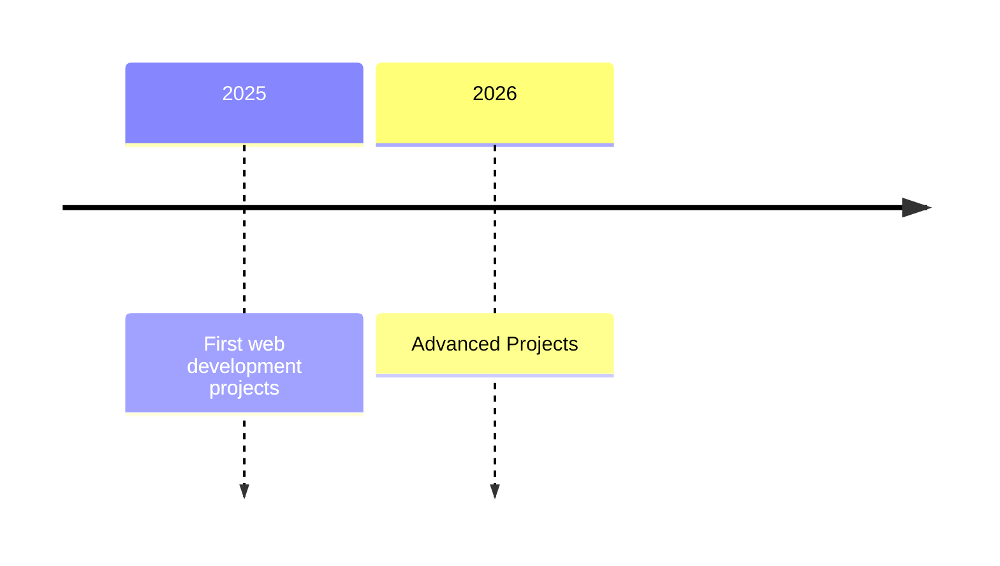

# 👨‍💻 Yan Marques

<p align="center">
  <h2></h2>
</p>

Hi! I'm Yan Marques, a 21-year-old Information Systems student. Passionate about tech from an early age, I've found that IT is more than just a career for me—it's a lifestyle. I'm constantly striving to learn, grow, and turn ideas into real-world solutions through code. This space reflects my journey of growth; every repository is another step toward becoming the professional I aspire to be. I'm always open to collaborations, new challenges, and mutually rewarding connections. Let's build something amazing together! 🚀

<p align="left">
    <a href="github.com/YaanMark?tab=repositories&sort=stargazers">
        
    </a>
    <a href="github.com/YaanMark?tab=followers">
        
    </a>
</p>

---

### 🤖 Stacks


<br/>
<br/>


---

## 🌐 Connect With Me

<p align="center">
    <a href="https://www.instagram.com/yaanmark">
        
    </a>
    <a href="https://www.linkedin.com/in/yaanmark">
        
    </a>
    <a href="mailto:yandumarques@gmail.com">
        
    </a>
</p>

---

## 🚀 Featured Projects

<div align="center">

| 💼 Project | 📖 Description | 🛠️ Technologies |
|------------|---------------|------------------|
| [**👨‍💼 Employee Manager**](https://github.com/YaanMark/Employee_Manager) | Full Stack CRUD application for employee management, allowing users to create, edit, view, and delete employee records through a modern interface. | HTML, CSS, JavaScript, Node.js, Express, MySQL |
| [**📝 To-Do List Fullstack**](https://github.com/YaanMark/to-do-list) |A complete task management system (To-Do List) built with a decoupled Full Stack architecture. This project allows users to perform complete **CRUD (Create, Read, Update, Delete)** operations on tasks through a clean, responsive interface integrated with a relational database.| HTML, CSS, JavaScript, Node.js, Express, MySQL, Prisma |
</div>

<br>

<div align="center">

### 🌟 Currently Working On

```txt
🔹 Full Stack Applications
🔹 RPG Systems & Game Design
🔹 React & Next.js Projects
🔹 API Development
```

</div>

<br>

<div align="center">

---




---

### 📈 Development Journey



</div>


<br/>
<br/>

<picture align="center">
  <source media="(prefers-color-scheme: dark)" srcset="https://raw.githubusercontent.com/YaanMark/YaanMark/output/github-contribution-grid-snake-dark.svg">
  <source media="(prefers-color-scheme: light)" srcset="https://raw.githubusercontent.com/YaanMark/YaanMark/output/github-contribution-grid-snake-dark.svg">
  
</picture>

---

<div align="center">

### 💜 "Turning ideas into reality, one line of code at a time."

</div>
