# 👨‍💻 Yan Marques

**`Desenvolvedor FullStack`**

Olá! Me chamo Yan Marques, tenho 21 anos e sou estudante de Sistemas de Informação. Apaixonado por tecnologia desde cedo, encontrei na área de TI não apenas uma carreira, mas um estilo de vida. Estou constantemente em busca de aprender, evoluir e transformar ideias em soluções reais através do código. Este espaço reflete minha jornada de crescimento cada repositório é um passo a mais na construção do profissional que quero me tornar. Aberto a colaborações, novos desafios e conexões que agreguem valor mútuo. Vamos construir algo incrível juntos! 🚀

    
    

---

### 🤖 Linguagens e Tecnologias

 
 
 
 

 
 

<picture align="center">
  <source media="(prefers-color-scheme: dark)" srcset="https://raw.githubusercontent.com/YaanMark/YaanMark/output/github-contribution-grid-snake-dark.svg">
  <source media="(prefers-color-scheme: light)" srcset="https://raw.githubusercontent.com/YaanMark/YaanMark/output/github-contribution-grid-snake-dark.svg">
  
</picture>
